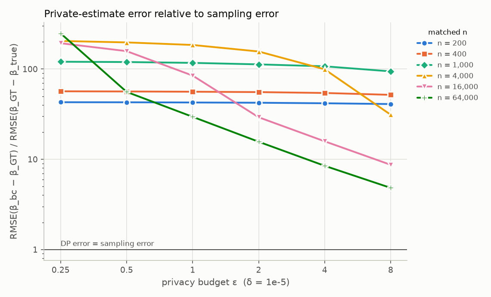
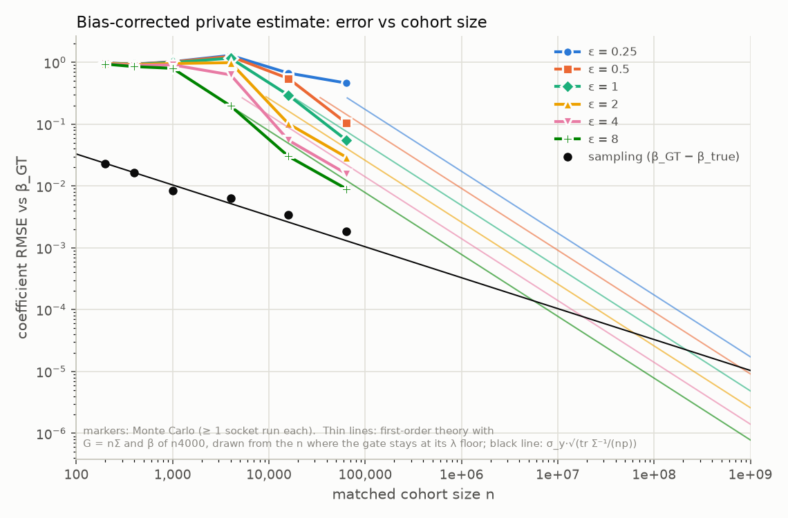
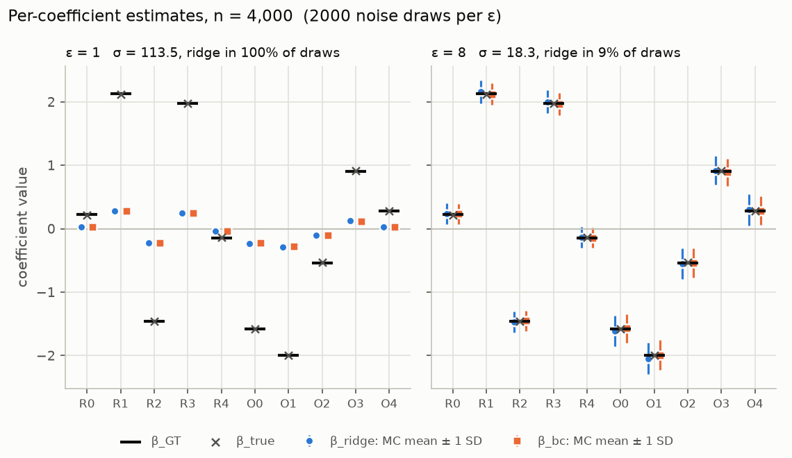

# Accuracy of the Scenario-B private VFL-OLS protocol

_Generated by `experiments/accuracy_study.py` from `results.json` in this folder; every number below is recomputed on each run._

**These results use the user's original modules.** Everything the parties executed is the user's unmodified code in `scenario_b/`: `party_r.py`, `party_o.py`, `run_protocol.py`, `calibrate_hyperparameters.py`, `generate_vfl_data.py` and the original `psi_common.py`, `phase1_common.py`, `he_backend.py`. The only added code on the data path is the `prepare_data.py` adapter that writes `y_O.csv`. An earlier round used stand-ins for the three modules; its results are kept in `standin_baseline/` and compared in the last section.

## Key findings

1. **PSI + HE are exact.** With the DP noise switched off (dp.sigma = 1e-09) the protocol returns the clipped-data ridge target with the (λ, Ψ) it chose to within 2.94e-10 (max abs, all 6 cohorts, plaintext backend) and 1.70e-10 with real OpenFHE encryption (n = 400). The gate never returns λ < 1e-3 (`auto_lambda` starts its geometric search there), so even at σ ≈ 0 it applies an O-block ridge of 1e-3 and the result differs from the clipped OLS by up to 1.16e-04: that is the floor's shrinkage, not a PSI/HE error. PSI recovered **exactly** the true matched set with the correct row alignment in every cohort (count, set and row-by-row alignment all checked).
2. **Clipping.** Features are U[0,1], so B_R = √d_R and B_O = √d_O never bind. B_y = 5 bound every matched |y| except in n64000 (0.31% of matched y clipped, max|y| = 5.79; clipping bias ‖β_clip − β_GT‖ = 0.0055 vs sampling error ‖β_GT − β_true‖ = 0.0059). Elsewhere β_clip = β_GT exactly, so private-vs-β_GT error is DP noise plus the ridge it forces.
3. **The DP noise is large relative to these Gram matrices.** With the committed bounds the joint sensitivity is Δ₂ = 30.4, giving σ = 18.3 at ε = 8 and σ = 404 at ε = 0.25; Gram entries are ≈ n/4 and λ_min(G) ≈ n/12. The ρ gate (Remark 4) therefore ridges in every noise draw unless n ≳ 4σ√p·12 (≈ 2,771 at ε = 8, ≈ 17,222 at ε = 1). 27 of 36 (cohort, ε) cells ridged in 100 % of draws, 26 of them with **full ridge** Ψ = I (the O-block ridge sufficed only for n64000 at ε = 0.25). Under full ridge the estimate is shrunk toward zero: relative error 37%–100% (100 % means β̃ ≈ 0), and ≥ 80 % in 21 of those 26 cells. The release stays valid but carries little or no signal.
4. **Best case in the grid:** n = 64,000, ε = 8: RMSE(β_bc − β_GT) = 0.0090, relative error 1.0%, still **4.8×** the sampling error RMSE(β_GT − β_true) = 0.0019. The DP error is never below the sampling error anywhere in the grid: with noise_std = 0.1 against a signal SD of 0.72–1.23 (R² 0.981–0.993) the sampling error is tiny.
5. **Where it would become indistinguishable.** Once the gate stays at its λ floor (1e-3, no effective ridge) the DP error falls like 1/n and the sampling error like 1/√n. The first-order theory (within 2.5% of the Monte-Carlo RMSE in all 8 cells at the λ floor) puts the crossover DP error = sampling error at n ≈ 5.6e+06 (ε = 8), n ≈ 1.8e+07 (ε = 4), n ≈ 2.2e+08 (ε = 1); a 10 % relative error needs n ≈ 5,784 (ε = 8), n ≈ 10,418 (ε = 4), n ≈ 35,947 (ε = 1).
6. **Bias correction works where the theory applies.** In the 8 (cohort, ε) cells where the gate stayed at the λ floor in every draw, the Monte-Carlo bias of β_ridge relative to β_clip has ‖bias‖ = 0.0399, 0.0095, 0.0038, 0.0313, 0.0092, 0.0027, 0.0019, 0.0006 (max |z| 9.2, 4.4, 2.5, 6.3, 4.1, 2.5, 3.4, 2.3), versus 0.0069, 0.0032, 0.0021, 0.0069, 0.0031, 0.0016, 0.0014, 0.0006 (max |z| 1.6, 1.4, 2.3, 1.5, 1.7, 1.5, 2.5, 2.1) for β_bc. Under full ridge the correction is immaterial: the error is the deterministic ridge shrinkage (Proposition 1), which the correction deliberately does not undo.

## What this means, plainly

* **The cryptographic layer is not the accuracy bottleneck.** Linkage and aggregation reproduce the plaintext answer (the clipped-data ridge target at the chosen λ) to ~1e-10; the error comes entirely from the DP noise and from what the solver does about it.
* **Two regimes, set by ρ = λ_min(G)/(2σ√p).** Below the gate threshold the Gram matrix is too noisy to invert safely and the solver adds a ridge large enough to make ρ = 2; in the full-ridge cells the median λ was 0.5× to 653× λ_min(G), so coefficients are pulled toward 0 (all the way when λ ≫ λ_min(G)). Above the threshold (λ at its 1e-3 floor) the bias-corrected estimate is unbiased up to O(σ⁴) and its error shrinks like σ/n.
* **Usable, not indistinguishable.** The first cells with a useful answer are n = 4,000 at ε = 8 (relative error 14%) and n = 16,000 at ε ≥ 2 (12% at ε = 2, 3.7% at ε = 8). Even there the DP error is 9–31× the sampling error, because this generator's sampling error is tiny (R² ≈ 0.99). A private estimate that is statistically indistinguishable from β_GT would need millions of matched records at ε = 8 for this signal-to-noise ratio; noisier outcomes lower that n quadratically.
* **Ridge vs bias-corrected.** At the λ floor, β_bc removes the O(σ²) bias the Monte Carlo can resolve (it is still small next to the DP standard deviation, as §6.6 of the paper predicts). Under full ridge the two are practically identical and both inherit the shrinkage.
* **The bound B_y matters most.** It enters Δ₂ as B_y⁴. On cohort n4000 at ε = 8, B_y = 10 → 5 → 3 gives RMSE(β_bc − β_GT) = 1.003 → 0.196 → 0.097 (ridge used in 100% → 8% → 0% of draws; the tightest bound clips 1.4% of y, a clipping bias of RMSE 0.015). B_y has to be justified from domain knowledge before seeing the data.
* **Socket runs agree with the Monte Carlo.** Each of the 36 full two-process runs is one noise draw; its RMSE percentile within the 2,000-draw MC distribution was outside 2.5–97.5 % in 2 case(s) (≈ 1.8 expected by chance), so the direct Phase-4/6 path reproduces the protocol.

## Issues found while running the user's code (original modules)

No user file was edited; workarounds live in inputs (`dp_params.json`) or in the adapter.

| # | where | what | effect here / workaround |
|---|---|---|---|
| 1 | `party_o.py:87-91` (with `psi_common.py:244`) | `bin_and_interpolate` returns D = min(d_cap, max_load), so D = 1 whenever no bin holds two O items; `party_o` then builds `ctL` = Enc(0) and never adds the label constant `L_layers[a][0]`, so every match decodes to O-row 0. | Reproduced with the originals on a 5-record O file: R printed 3 matches but built n = 1 (`MISMATCH`). Not triggered in the study (D ≥ 4). |
| 2 | `phase1_common.py:124-133, 136-160` | `auto_lambda` starts its search at λ = 1e-3 and `select_ridge` has no λ = 0 branch, so for σ > 0 the solver always ridges (Ψ = Π_O, λ ≥ 1e-3) even when ρ(0) ≥ target; the paper's Remark 4 keeps λ = 0 then. | Numerically small (see finding 1), but the σ ≈ 0 exactness check has to compare against the ridge target, and `run_protocol.py`'s σ ≈ 0 verification prints ‖β − β_OLS‖ ≈ 1e-4, not 0. |
| 3 | `phase1_common.py:124-133` | Geometric search (×1.5) returns the first grid point with ρ ≥ target, overshooting the minimal λ by up to 1.5×. | More shrinkage in ridge cells than the minimal λ would give (quantified in the comparison section). |
| 4 | `phase1_common.py:153-156` | The O-block branch is taken whenever ceiling ≥ target, but λ_min(G + λΠ_O) only approaches the ceiling asymptotically, so the λ needed grows like 1/(ceiling − target): on a test Gram λ = 971 at ceiling/target = 1.0001, 1.3e5 at 1 + 1e-6, 4.2e8 at 1 + 1e-10, versus λ = 38 had it escalated to Ψ = I. The O coefficients are then shrunk to ≈ 0, and the choice is discontinuous in σ. | Follows Remark 4 literally; never stalled at `cap` in tests. In the study the O-block branch raised λ above the floor in: n4000 at ε = 8 (9% of draws, clean ceiling ρ = 2.8, median λ = 0.001 = 3.2e-06× λ_min(G)); n64000 at ε = 0.25 (100% of draws, clean ceiling ρ = 2.1, median λ = 1.11e+04 = 2.1× λ_min(G)). Neither reached the blow-up regime. |
| 5 | `run_protocol.py:32-33` | Verification checks only the match count, not the alignment, and compares to raw-data OLS (so clipping bias or the λ floor shows up as 'protocol error'). | Alignment audited separately. |
| 6 | `party_r.py:140` | dp.sigma = 0 divides by zero. | Only a numpy RuntimeWarning (ceiling = inf); the run completes with Ψ = O, λ = 0. σ = 1e-9 used for (e) as instructed. |
| 7 | `psi_common.py:62-66` | `recv_msg` returns None on EOF and the parties pass it straight to `pickle.loads`, so a peer crash surfaces as an opaque `TypeError`. | Not hit in these runs (from reading). |
| 8 | `psi_common.py:140-157, 260` | Within-partition field collisions keep the first row and drop the later one, but the kept root still matches a query for the dropped ID, so R would silently pair that ID with the kept row's label (a misalignment, not a drop). | Not hit (0 collisions in every run; probability ≈ n_O·N_HASH·load/t). From reading. |
| 9 | `generate_vfl_data.py` vs `party_o.py:44` | The generator writes `y.csv` (matched rows); the parties read `y_O.csv` (all n_O rows). | `scenario_b/prepare_data.py` adapter. |
| 10 | `calibrate_hyperparameters.py:288-289` | `n_column_chunks` is always 1 and no party chunks columns; a CKKS ciphertext holds at most N/2 slots (OpenFHE: 65,536), so larger n_O cannot run under OpenFHE. | OpenFHE run kept to n_O = 4,000; the plaintext backend has no slot limit. |
| 11 | paper App. B vs code | The code implements Chen–Laine–Rindal labeled PSI rather than App. B's construction. | — |

Resolved relative to the stand-in round: the spurious 'rho below target' warning (`party_r.py:144`) does not fire, because the grid λ overshoots the target (ρ ≥ target in every MC draw); and the original cuckoo insertion (`psi_common.py:182-204`, max_kicks = 5000, SHA-256 bin hashes) succeeded for every batch in the study and in 20/20 random full batches of 14,745 IDs into 16,384 bins.

## Setup

* Data: `scenario_b/prepare_data.py` → `generate_vfl_data.py` (unmodified), scenario B, d_R = d_O = 5, noise_std = 0.1, seed = 42; covariates U[0,1], β ~ N(0, 1) (so β differs between cohorts: the generator's RNG stream depends on the sizes). `y_O.csv` for unmatched O rows is simulated from the same model with a fresh latent x_R (it never enters any protocol statistic).
* Cohorts (n = n_intersect): n200: n_R = 250, n_O = 2,000; n400: n_R = 500, n_O = 4,000; n1000: n_R = 1,250, n_O = 4,000; n4000: n_R = 5,000, n_O = 8,000; n16000: n_R = 20,000, n_O = 32,000 _(extension)_; n64000: n_R = 80,000, n_O = 80,000 _(extension)_.
* Committed bounds (fixed before seeing data): B_R = √5 = 2.2361, B_O = √5 = 2.2361 (U[0,1] rows cannot exceed them), B_y = 5. B_y is the one real choice: under the generating model |y| ≤ Σ⁺β_j + noise, and a prior-predictive simulation (β ~ N(0, I₁₀), 5 000 rows) puts max|y| at ≈ 4.0 (median) / 5.8 (90 %) / 7.5 (99 %); 5 is a round value above this dataset family's plausible range. **In a deployment B_y must come from domain knowledge fixed a priori**, never from the realised sample; its effect on accuracy is shown in the B_y section below.
* DP: δ = 1e-05, ε ∈ {0.25, 0.5, 1, 2, 4, 8}, analytic Gaussian (Balle–Wang) σ from `calibrate_hyperparameters.py`, `--standardize none`, ρ_target = 2.
* Per (cohort, ε): **one full socket run** through `run_protocol.py --backend plaintext` (both parties as processes over loopback) and **2,000 Monte-Carlo noise draws** that reuse the audited PSI output (R's X̄_R in O's row order, captured from a socket run) and call the same Phase-4/6 code the parties use (`phase1_common.draw_noise` → `assemble` → `solve_and_correct`). The plaintext HE backend is exact, so this reproduces the protocol's arithmetic; each socket draw's RMSE percentile within the MC distribution is stored in `results.json` (`socket.rmse_pct_in_mc_bc`).
* Metrics per estimator: RMSE = √(mean over draws and coefficients of error²); max-abs = mean over draws of the worst coefficient's |error|; relative = mean ‖error‖/‖β_ref‖; R-/O-block RMSE split the 5 + 5 coefficients; bias = MC mean − β_clip with SE = SD/√reps; 'ridge' = fraction of draws where the gate had to raise λ above its 1e-3 floor (ρ(1e-3) < 2), 'full' = fraction escalated to Ψ = I.

## (a)–(e): references and PSI/HE verification

| cohort | n | (c) linkage precision | (c) recall | (c) max\|β_plain−β_GT\| | max\|y\| matched | y clip rate | (d) ‖β_clip−β_GT‖ | (e) PSI matches | (e) set = truth | (e) rows misaligned | (e) max\|β_σ≈0 − ridge target\| | (e) max\|β_σ≈0−β_clip\| | ‖β_GT−β_true‖ |
|---|---|---|---|---|---|---|---|---|---|---|---|---|---|
| n200 | 200 | 1.0000 | 1.0000 | 0.0000 | 2.8034 | 0.0000 | 0.0000 | 200 | yes | 0 | 2.94e-10 | 1.16e-04 | 0.0723 |
| n400 | 400 | 1.0000 | 1.0000 | 0.0000 | 2.7801 | 0.0000 | 0.0000 | 400 | yes | 0 | 1.55e-10 | 3.73e-05 | 0.0522 |
| n1000 | 1,000 | 1.0000 | 1.0000 | 0.0000 | 3.2114 | 0.0000 | 0.0000 | 1,000 | yes | 0 | 9.02e-11 | 3.23e-05 | 0.0269 |
| n4000 | 4,000 | 1.0000 | 1.0000 | 0.0000 | 4.5352 | 0.0000 | 0.0000 | 4,000 | yes | 0 | 1.53e-11 | 5.00e-06 | 0.0200 |
| n16000 | 16,000 | 1.0000 | 1.0000 | 0.0000 | 2.6829 | 0.0000 | 0.0000 | 16,000 | yes | 0 | 1.02e-12 | 8.57e-07 | 0.0110 |
| n64000 | 64,000 | 1.0000 | 1.0000 | 0.0000 | 5.7924 | 0.0031 | 0.0055 | 64,000 | yes | 0 | 1.50e-12 | 2.14e-07 | 0.0059 |

(e) is from an audited socket run: `party_r.run()` unmodified, with `phase1_common.local_A` wrapped to save the aligned matrix X̄_R that R builds from the PSI output; it is compared row by row with the generator's ground truth (`sigma.csv`). `run_protocol.py`'s own check compares only the match *count*. 'Ridge target' = the user's `oracle_ridge` on the clipped data with the (λ, Ψ) the run chose (λ = 1e-3, Ψ = Π_O at σ ≈ 0); the gap to β_clip is that floor ridge's shrinkage.

**Real HE (OpenFHE 1.5.1, BFVrns N = 16384 for PSI, CKKSrns scale 2⁵⁰ for Phase 1), cohort n400:** PSI matched 400/400, set equal = True, rows misaligned = 0; max|β_bc − ridge target| = 1.70e-10, max|β_bc − β_clip| = 3.73e-05, max|β_bc(OpenFHE) − β_bc(plaintext)| = 2.62e-10 (both runs carry independent σ = 1e-9 draws, so this bounds CKKS error + that noise); wall time 13 s.
An ε = 1 OpenFHE run on the same cohort also completed (Ψ = I, λ = 2184, RMSE(β_bc − β_GT) = 0.9299, 14 s).

## (f) Private estimates across ε and n (bias-corrected estimator)

| cohort | ε | σ | ridge / full | RMSE vs β_GT | R-block | O-block | max-abs vs β_GT | rel. err vs β_GT | RMSE vs β_true | max-abs vs β_true | sampling RMSE | DP / sampling | 1st-order theory (λ=0) | socket run RMSE |
|---|---|---|---|---|---|---|---|---|---|---|---|---|---|---|
| n200 | 0.25 | 404.0635 | 100% / 100% | 0.9804 | 0.9149 | 1.0419 | 1.6892 | 0.9984 | 0.9692 | 1.6689 | 0.0229 | 42.8869 | 74.4399 | 0.9739 |
| n200 | 0.5 | 213.8647 | 100% / 100% | 0.9787 | 0.9116 | 1.0415 | 1.6838 | 0.9967 | 0.9675 | 1.6632 | 0.0229 | 42.8120 | 39.3999 | 0.9993 |
| n200 | 1 | 113.4627 | 100% / 100% | 0.9737 | 0.9040 | 1.0388 | 1.6700 | 0.9916 | 0.9625 | 1.6500 | 0.0229 | 42.5940 | 20.9030 | 0.9656 |
| n200 | 2 | 60.6394 | 100% / 100% | 0.9675 | 0.8967 | 1.0336 | 1.6501 | 0.9853 | 0.9563 | 1.6302 | 0.0229 | 42.3230 | 11.1715 | 0.9775 |
| n200 | 4 | 32.8823 | 100% / 100% | 0.9545 | 0.8794 | 1.0241 | 1.6173 | 0.9720 | 0.9433 | 1.5989 | 0.0229 | 41.7529 | 6.0578 | 0.9848 |
| n200 | 8 | 18.2553 | 100% / 100% | 0.9357 | 0.8569 | 1.0084 | 1.5823 | 0.9528 | 0.9245 | 1.5659 | 0.0229 | 40.9306 | 3.3631 | 0.9385 |
| n400 | 0.25 | 404.0635 | 100% / 100% | 0.9349 | 0.8953 | 0.9728 | 1.2706 | 0.9981 | 0.9277 | 1.2742 | 0.0165 | 56.6606 | 34.1890 | 0.9133 |
| n400 | 0.5 | 213.8647 | 100% / 100% | 0.9309 | 0.8914 | 0.9687 | 1.2611 | 0.9938 | 0.9237 | 1.2655 | 0.0165 | 56.4174 | 18.0957 | 0.9294 |
| n400 | 1 | 113.4627 | 100% / 100% | 0.9249 | 0.8858 | 0.9625 | 1.2525 | 0.9874 | 0.9177 | 1.2558 | 0.0165 | 56.0581 | 9.6004 | 0.9233 |
| n400 | 2 | 60.6394 | 100% / 100% | 0.9161 | 0.8779 | 0.9528 | 1.2352 | 0.9781 | 0.9089 | 1.2386 | 0.0165 | 55.5252 | 5.1309 | 0.9118 |
| n400 | 4 | 32.8823 | 100% / 100% | 0.8958 | 0.8596 | 0.9305 | 1.2040 | 0.9563 | 0.8886 | 1.2061 | 0.0165 | 54.2909 | 2.7823 | 0.8953 |
| n400 | 8 | 18.2553 | 100% / 100% | 0.8541 | 0.8210 | 0.8859 | 1.1477 | 0.9117 | 0.8469 | 1.1475 | 0.0165 | 51.7631 | 1.5446 | 0.8495 |
| n1000 | 0.25 | 404.0635 | 100% / 100% | 1.0237 | 0.5859 | 1.3239 | 2.5164 | 0.9862 | 1.0221 | 2.5260 | 0.0085 | 120.4682 | 15.8783 | 1.0210 |
| n1000 | 0.5 | 213.8647 | 100% / 100% | 1.0160 | 0.5767 | 1.3161 | 2.4914 | 0.9789 | 1.0144 | 2.5010 | 0.0085 | 119.5637 | 8.4042 | 0.9905 |
| n1000 | 1 | 113.4627 | 100% / 100% | 0.9945 | 0.5546 | 1.2925 | 2.4191 | 0.9581 | 0.9929 | 2.4287 | 0.0085 | 117.0286 | 4.4587 | 0.9868 |
| n1000 | 2 | 60.6394 | 100% / 100% | 0.9571 | 0.5250 | 1.2476 | 2.3114 | 0.9220 | 0.9555 | 2.3210 | 0.0085 | 112.6312 | 2.3829 | 0.9690 |
| n1000 | 4 | 32.8823 | 100% / 100% | 0.9112 | 0.4944 | 1.1900 | 2.1896 | 0.8778 | 0.9096 | 2.1992 | 0.0085 | 107.2259 | 1.2922 | 0.9281 |
| n1000 | 8 | 18.2553 | 100% / 100% | 0.8007 | 0.4268 | 1.0489 | 1.9144 | 0.7712 | 0.7992 | 1.9241 | 0.0085 | 94.2242 | 0.7174 | 0.7941 |
| n4000 | 0.25 | 404.0635 | 100% / 100% | 1.2944 | 1.3972 | 1.1827 | 2.0429 | 0.9572 | 1.2926 | 2.0385 | 0.0063 | 204.6759 | 4.3647 | 1.2760 |
| n4000 | 0.5 | 213.8647 | 100% / 100% | 1.2477 | 1.3475 | 1.1392 | 1.9707 | 0.9225 | 1.2459 | 1.9664 | 0.0063 | 197.2918 | 2.3102 | 1.2441 |
| n4000 | 1 | 113.4627 | 100% / 100% | 1.1688 | 1.2634 | 1.0658 | 1.8472 | 0.8641 | 1.1669 | 1.8429 | 0.0063 | 184.8082 | 1.2256 | 1.1812 |
| n4000 | 2 | 60.6394 | 100% / 100% | 0.9896 | 1.0693 | 0.9029 | 1.5680 | 0.7310 | 0.9878 | 1.5643 | 0.0063 | 156.4749 | 0.6550 | 0.9817 |
| n4000 | 4 | 32.8823 | 100% / 100% | 0.6280 | 0.6740 | 0.5783 | 1.0229 | 0.4624 | 0.6262 | 1.0202 | 0.0063 | 99.2981 | 0.3552 | 0.6453 |
| n4000 | 8 | 18.2553 | 9% / 0% | 0.1973 | 0.1635 | 0.2261 | 0.3703 | 0.1406 | 0.1975 | 0.3704 | 0.0063 | 31.1978 | 0.1972 | 0.1248 |
| n16000 | 0.25 | 404.0635 | 100% / 100% | 0.6699 | 0.7347 | 0.5982 | 1.2027 | 0.8497 | 0.6698 | 1.2034 | 0.0035 | 193.2864 | 0.6684 | 0.6475 |
| n16000 | 0.5 | 213.8647 | 100% / 100% | 0.5472 | 0.5983 | 0.4909 | 0.9772 | 0.6928 | 0.5471 | 0.9779 | 0.0035 | 157.8841 | 0.3538 | 0.5718 |
| n16000 | 1 | 113.4627 | 100% / 100% | 0.2933 | 0.3154 | 0.2695 | 0.5138 | 0.3676 | 0.2932 | 0.5146 | 0.0035 | 84.6284 | 0.1877 | 0.2391 |
| n16000 | 2 | 60.6394 | 0% / 0% | 0.1013 | 0.0834 | 0.1165 | 0.1906 | 0.1238 | 0.1013 | 0.1908 | 0.0035 | 29.2188 | 0.1003 | 0.0733 |
| n16000 | 4 | 32.8823 | 0% / 0% | 0.0548 | 0.0450 | 0.0631 | 0.1037 | 0.0674 | 0.0549 | 0.1040 | 0.0035 | 15.8191 | 0.0544 | 0.0512 |
| n16000 | 8 | 18.2553 | 0% / 0% | 0.0301 | 0.0248 | 0.0346 | 0.0565 | 0.0370 | 0.0303 | 0.0571 | 0.0035 | 8.6892 | 0.0302 | 0.0239 |
| n64000 | 0.25 | 404.0635 | 100% / 0% | 0.4623 | 0.2732 | 0.5940 | 0.8540 | 0.5004 | 0.4626 | 0.8545 | 0.0019 | 248.4536 | 0.1938 | 0.5545 |
| n64000 | 0.5 | 213.8647 | 0% / 0% | 0.1039 | 0.0916 | 0.1149 | 0.1940 | 0.1101 | 0.1039 | 0.1941 | 0.0019 | 55.8228 | 0.1026 | 0.0409 |
| n64000 | 1 | 113.4627 | 0% / 0% | 0.0550 | 0.0483 | 0.0610 | 0.1027 | 0.0583 | 0.0551 | 0.1028 | 0.0019 | 29.5565 | 0.0544 | 0.0405 |
| n64000 | 2 | 60.6394 | 0% / 0% | 0.0291 | 0.0257 | 0.0321 | 0.0544 | 0.0309 | 0.0292 | 0.0546 | 0.0019 | 15.6429 | 0.0291 | 0.0256 |
| n64000 | 4 | 32.8823 | 0% / 0% | 0.0158 | 0.0140 | 0.0173 | 0.0295 | 0.0167 | 0.0159 | 0.0298 | 0.0019 | 8.4684 | 0.0158 | 0.0148 |
| n64000 | 8 | 18.2553 | 0% / 0% | 0.0090 | 0.0080 | 0.0099 | 0.0167 | 0.0095 | 0.0093 | 0.0173 | 0.0019 | 4.8232 | 0.0088 | 0.0088 |

β_ridge rows are in `results_summary.csv` (estimator = ridge); in the full-ridge cells their RMSE differs from β_bc's by at most 3.2%. The first-order theory column is √(tr Cov/p) with Cov = σ²P[I + χ∘ββᵀ + diag(χβ²) − Π_O diag(β²)]P (Lemma 1 applied to P f − P E β, P = G⁻¹ of the clean Gram); it describes λ ≈ 0 only, so compare it with the MC only where 'ridge' is 0 %. Elsewhere it is what an un-ridged release would give, and is meaningless where ρ(0) < 1.

## Monte-Carlo bias of β_ridge and β_bc relative to β_clip (d)

| cohort | ε | ridge / full | ‖bias‖ ridge | max\|z\| ridge | ‖bias‖ bc | max\|z\| bc | ‖SE‖ (bc) | ‖Thm-1 bias‖ at λ=0 |
|---|---|---|---|---|---|---|---|---|
| n200 | 0.25 | 100% / 100% | 3.0955 | 1381.3083 | 3.0957 | 1427.1434 | 0.0038 | – |
| n200 | 0.5 | 100% / 100% | 3.0917 | 1710.4810 | 3.0919 | 1746.5237 | 0.0031 | – |
| n200 | 1 | 100% / 100% | 3.0744 | 1381.1127 | 3.0749 | 1422.1346 | 0.0036 | – |
| n200 | 2 | 100% / 100% | 3.0556 | 1574.1005 | 3.0563 | 1615.8730 | 0.0032 | – |
| n200 | 4 | 100% / 100% | 3.0131 | 1421.1010 | 3.0145 | 1459.7213 | 0.0034 | – |
| n200 | 8 | 100% / 100% | 2.9523 | 1347.1615 | 2.9548 | 1386.8486 | 0.0035 | – |
| n400 | 0.25 | 100% / 100% | 2.9513 | 1001.9704 | 2.9515 | 1035.1359 | 0.0038 | – |
| n400 | 0.5 | 100% / 100% | 2.9401 | 1276.5483 | 2.9404 | 1302.6631 | 0.0031 | – |
| n400 | 1 | 100% / 100% | 2.9197 | 1074.7197 | 2.9206 | 1105.8362 | 0.0035 | – |
| n400 | 2 | 100% / 100% | 2.8920 | 1166.1708 | 2.8934 | 1199.6928 | 0.0033 | – |
| n400 | 4 | 100% / 100% | 2.8262 | 1100.1635 | 2.8287 | 1128.6694 | 0.0033 | – |
| n400 | 8 | 100% / 100% | 2.6890 | 898.1725 | 2.6954 | 917.1923 | 0.0038 | – |
| n1000 | 0.25 | 100% / 100% | 3.2319 | 1992.2619 | 3.2330 | 2057.7151 | 0.0037 | – |
| n1000 | 0.5 | 100% / 100% | 3.2090 | 2490.0882 | 3.2100 | 2545.8051 | 0.0031 | – |
| n1000 | 1 | 100% / 100% | 3.1382 | 2112.5921 | 3.1410 | 2171.9836 | 0.0035 | – |
| n1000 | 2 | 100% / 100% | 3.0154 | 1603.3485 | 3.0217 | 1679.7257 | 0.0039 | – |
| n1000 | 4 | 100% / 100% | 2.8700 | 1788.2060 | 2.8772 | 1858.6925 | 0.0035 | – |
| n1000 | 8 | 100% / 100% | 2.5088 | 1331.5868 | 2.5250 | 1389.3014 | 0.0042 | – |
| n4000 | 0.25 | 100% / 100% | 4.0863 | 1783.0806 | 4.0901 | 1812.1142 | 0.0036 | – |
| n4000 | 0.5 | 100% / 100% | 3.9353 | 1461.3561 | 3.9420 | 1499.1566 | 0.0038 | – |
| n4000 | 1 | 100% / 100% | 3.6832 | 1494.6933 | 3.6924 | 1533.9134 | 0.0037 | – |
| n4000 | 2 | 100% / 100% | 3.0994 | 762.7293 | 3.1199 | 795.5630 | 0.0054 | – |
| n4000 | 4 | 100% / 100% | 1.9014 | 348.1645 | 1.9496 | 370.4980 | 0.0085 | 0.2823 |
| n4000 | 8 | 9% / 0% | 0.0779 | 8.5367 | 0.0235 | 3.3862 | 0.0139 | 0.0870 |
| n16000 | 0.25 | 100% / 100% | 2.1075 | 1136.1399 | 2.1133 | 1154.9351 | 0.0033 | – |
| n16000 | 0.5 | 100% / 100% | 1.7038 | 538.4395 | 1.7183 | 559.6252 | 0.0046 | – |
| n16000 | 1 | 100% / 100% | 0.8418 | 210.6494 | 0.8779 | 225.8183 | 0.0067 | 0.1247 |
| n16000 | 2 | 0% / 0% | 0.0399 | 9.2418 | 0.0069 | 1.6119 | 0.0072 | 0.0356 |
| n16000 | 4 | 0% / 0% | 0.0095 | 4.4378 | 0.0032 | 1.3623 | 0.0039 | 0.0105 |
| n16000 | 8 | 0% / 0% | 0.0038 | 2.4614 | 0.0021 | 2.2700 | 0.0021 | 0.0032 |
| n64000 | 0.25 | 100% / 0% | 1.4107 | 253.4115 | 1.4181 | 260.3887 | 0.0077 | 0.1017 |
| n64000 | 0.5 | 0% / 0% | 0.0313 | 6.2757 | 0.0069 | 1.5175 | 0.0073 | 0.0285 |
| n64000 | 1 | 0% / 0% | 0.0092 | 4.0981 | 0.0031 | 1.6854 | 0.0039 | 0.0080 |
| n64000 | 2 | 0% / 0% | 0.0027 | 2.4816 | 0.0016 | 1.5060 | 0.0021 | 0.0023 |
| n64000 | 4 | 0% / 0% | 0.0019 | 3.4372 | 0.0014 | 2.5130 | 0.0011 | 6.73e-04 |
| n64000 | 8 | 0% / 0% | 5.77e-04 | 2.3132 | 5.90e-04 | 2.1008 | 6.22e-04 | 2.08e-04 |

z = bias/SE per coefficient (|z| > 3 ⇒ bias resolved by the Monte Carlo). The last column is the Theorem-1 prediction σ²M(P)β̂ on the clean Gram, i.e. the O(σ²) bias an un-ridged private OLS would have; it is shown only where ρ(0) ≥ 1 on the clean Gram ('–' otherwise: the Neumann expansion diverges). Where the gate ridges, the realised bias against β_clip is dominated by the deterministic ridge shrinkage −λP_λΨβ̂ (Proposition 1), which neither estimator removes by design.

## Per-coefficient table: cohort n4000 (n = 4,000), ε = 8

σ = 18.26; ridge used in 9% of draws (full ridge 0%); socket run: Ψ = O, λ = 0.0010.

| coef | (a) β_true | (b) β_GT | (c) β_plain | (d) β_clip | (e) σ≈0 protocol | socket ridge | socket bc | MC mean ridge | bias ridge | SE | MC mean bc | bias bc | SE | SD bc | Thm-1 bias |
|---|---|---|---|---|---|---|---|---|---|---|---|---|---|---|---|
| R0 | 0.2164 | 0.2258 | 0.2258 | 0.2258 | 0.2258 | 0.3120 | 0.3013 | 0.2375 | 0.0117 | 0.0037 | 0.2305 | 0.0047 | 0.0036 | 0.1594 | 0.0062 |
| R1 | 2.1185 | 2.1230 | 2.1230 | 2.1230 | 2.1230 | 2.2537 | 2.2122 | 2.1575 | 0.0345 | 0.0040 | 2.1213 | -0.0018 | 0.0039 | 0.1728 | 0.0332 |
| R2 | -1.4575 | -1.4570 | -1.4570 | -1.4570 | -1.4570 | -1.3815 | -1.3670 | -1.4691 | -0.0120 | 0.0036 | -1.4534 | 0.0036 | 0.0035 | 0.1559 | -0.0146 |
| R3 | 1.9703 | 1.9705 | 1.9705 | 1.9705 | 1.9705 | 1.9352 | 1.9000 | 2.0003 | 0.0298 | 0.0040 | 1.9635 | -0.0070 | 0.0038 | 0.1711 | 0.0338 |
| R4 | -0.1414 | -0.1431 | -0.1431 | -0.1431 | -0.1431 | -0.2113 | -0.2128 | -0.1411 | 0.0020 | 0.0037 | -0.1447 | -0.0016 | 0.0035 | 0.1575 | 0.0032 |
| O0 | -1.5777 | -1.5818 | -1.5818 | -1.5818 | -1.5818 | -1.3709 | -1.3403 | -1.6161 | -0.0343 | 0.0053 | -1.5725 | 0.0093 | 0.0051 | 0.2259 | -0.0398 |
| O1 | -2.0002 | -2.0018 | -2.0018 | -2.0018 | -2.0018 | -2.2959 | -2.2285 | -2.0476 | -0.0458 | 0.0054 | -1.9915 | 0.0103 | 0.0052 | 0.2304 | -0.0512 |
| O2 | -0.5260 | -0.5388 | -0.5388 | -0.5388 | -0.5388 | -0.6384 | -0.6227 | -0.5501 | -0.0113 | 0.0054 | -0.5406 | -0.0018 | 0.0052 | 0.2306 | -0.0087 |
| O3 | 0.9122 | 0.9065 | 0.9065 | 0.9065 | 0.9065 | 0.9676 | 0.9397 | 0.9180 | 0.0115 | 0.0050 | 0.8903 | -0.0162 | 0.0048 | 0.2139 | 0.0257 |
| O4 | 0.2745 | 0.2827 | 0.2827 | 0.2827 | 0.2827 | 0.2130 | 0.2035 | 0.2956 | 0.0129 | 0.0054 | 0.2836 | 8.41e-04 | 0.0051 | 0.2285 | 0.0107 |

## When does the private estimate become indistinguishable from β_GT?

Criterion: DP-induced RMSE (private vs β_GT) ≤ sampling RMSE (β_GT vs β_true). Extrapolated with the first-order theory using G = nΣ, Σ = E[zzᵀ] = I/12 + 11ᵀ/4 (λ_min(Σ) = 1/12) and β of cohort n4000: RMSE_DP ≈ σ·42.84/n and RMSE_sampling ≈ 0.329/√n. 'λ-floor gate' is the n above which ρ(0) ≥ 2 on the clean Gram (below it the gate ridges and the estimate is shrunk).

| ε | σ | n for λ-floor gate | n for 10 % rel. error | n: DP = sampling | n: DP = 0.3 × sampling |
|---|---|---|---|---|---|
| 0.25 | 404.1 | 61332.5 | 1.28e+05 | 2.76e+09 | 3.07e+10 |
| 0.5 | 213.9 | 32462.4 | 67756.4 | 7.75e+08 | 8.61e+09 |
| 1 | 113.5 | 17222.4 | 35947.1 | 2.18e+08 | 2.42e+09 |
| 2 | 60.6 | 9204.4 | 19211.7 | 6.23e+07 | 6.92e+08 |
| 4 | 32.9 | 4991.2 | 10417.7 | 1.83e+07 | 2.03e+08 |
| 8 | 18.3 | 2771.0 | 5783.6 | 5.64e+06 | 6.27e+07 |

These n are for this generator's very high signal-to-noise (noise_std = 0.1). The DP term does not depend on noise_std, while the sampling term scales with it, so n* ∝ 1/noise_std²: with noise_std = 1 the crossover n would be 100× smaller. They also scale with B_y: σ ∝ Δ₂ and Δ₂² = (B_O²+B_R²)(B_O²+B_y²)+B_y⁴, so B_y dominates the budget whenever B_y² ≫ B_O² + B_R².

## Sensitivity to the committed bound B_y (cohort n4000, MC only)

| B_y | ε | Δ₂ | σ | y clip rate | RMSE(β_clip − β_GT) | ridge | RMSE ridge vs β_GT | RMSE bc vs β_GT |
|---|---|---|---|---|---|---|---|---|
| 3 | 0.25 | 14.8661 | 197.5035 | 0.0143 | 0.0152 | 1.0000 | 1.2289 | 1.2315 |
| 3 | 0.5 | 14.8661 | 104.5356 | 0.0143 | 0.0152 | 1.0000 | 1.1292 | 1.1336 |
| 3 | 1 | 14.8661 | 55.4598 | 0.0143 | 0.0152 | 1.0000 | 0.9147 | 0.9236 |
| 3 | 2 | 14.8661 | 29.6402 | 0.0143 | 0.0152 | 1.0000 | 0.5296 | 0.5452 |
| 3 | 4 | 14.8661 | 16.0726 | 0.0143 | 0.0152 | 0.0040 | 0.1818 | 0.1758 |
| 3 | 8 | 14.8661 | 8.9230 | 0.0143 | 0.0152 | 0.0000 | 0.0970 | 0.0967 |
| 5 | 0.25 | 30.4138 | 404.0635 | 0.0000 | 0.0000 | 1.0000 | 1.2942 | 1.2954 |
| 5 | 0.5 | 30.4138 | 213.8647 | 0.0000 | 0.0000 | 1.0000 | 1.2452 | 1.2473 |
| 5 | 1 | 30.4138 | 113.4627 | 0.0000 | 0.0000 | 1.0000 | 1.1667 | 1.1695 |
| 5 | 2 | 30.4138 | 60.6394 | 0.0000 | 0.0000 | 1.0000 | 0.9846 | 0.9908 |
| 5 | 4 | 30.4138 | 32.8823 | 0.0000 | 0.0000 | 1.0000 | 0.6086 | 0.6227 |
| 5 | 8 | 30.4138 | 18.2553 | 0.0000 | 0.0000 | 0.0820 | 0.2076 | 0.1964 |
| 10 | 0.25 | 105.1190 | 1396.5609 | 0.0000 | 0.0000 | 1.0000 | 1.3353 | 1.3357 |
| 10 | 0.5 | 105.1190 | 739.1784 | 0.0000 | 0.0000 | 1.0000 | 1.3256 | 1.3259 |
| 10 | 1 | 105.1190 | 392.1602 | 0.0000 | 0.0000 | 1.0000 | 1.2926 | 1.2937 |
| 10 | 2 | 105.1190 | 209.5875 | 0.0000 | 0.0000 | 1.0000 | 1.2382 | 1.2405 |
| 10 | 4 | 105.1190 | 113.6506 | 0.0000 | 0.0000 | 1.0000 | 1.1658 | 1.1686 |
| 10 | 8 | 105.1190 | 63.0955 | 0.0000 | 0.0000 | 1.0000 | 0.9970 | 1.0028 |

A tighter bound lowers σ roughly ∝ B_y² (the B_y⁴ term dominates Δ₂) but clips real responses; the clipping bias RMSE(β_clip − β_GT) is deterministic and does not shrink with n.

## Original modules vs the earlier stand-ins

Both rounds used the same data, bounds, seeds and noise draws (the MC generator is seeded per cohort and both `draw_noise` implementations consume it in the same order), so each cell compares the two solvers on identical noisy statistics. Full per-cell numbers: `standin_vs_original.csv`.

* **λ overshoot (geometric search).** In the 27 cells where the gate ridged, the median λ is 1.03–1.50× the stand-in's minimal λ (median 1.28×; the grid step bounds it by 1.5×). The extra shrinkage moves RMSE vs β_GT by +0.0 % to +11.5 % (median +1.0 %), largest where λ is comparable to λ_min(G) so that shrinkage is partial.
* **λ floor 1e-3.** Where the stand-in used λ = 0 (9 cells), the originals use λ = 1e-3 on the O block; RMSE moves by -0.05 % to +0.00 % and ‖bias‖ vs β_clip by at most 1.5e-03. At σ ≈ 0 the floor is visible: max|β − β_clip| is 1.16e-04 (stand-ins: 3.45e-10), while max|β − ridge target| is 2.94e-10.
* **Gate decisions.** 0 of 36 cells changed their ridge/full-ridge fractions (threshold `>=` vs the stand-in's `>`, and grid vs exact λ).
* **PSI.** Same outcome (exact set and alignment everywhere). The originals hash with SHA-256 instead of BLAKE2b and pad every partition to degree D with dummy roots; D per cohort (stand-in → original): n200 4 → 4, n400 6 → 6, n1000 6 → 6, n4000 10 → 9, n16000 18 → 17, n64000 31 → 32.
* **Cuckoo hashing.** The stand-in's first 1,000-kick limit failed at n16000; the originals' 5,000 kicks succeeded everywhere (see issues).
* **Unchanged by construction:** Δ₂ and σ (same calibration code), clipping, linkage (c), β_GT, the Theorem-1 bias operator (the original `_bias_operator` equals the stand-in's M to machine precision).

| cohort | ε | ridge/full (stand-in) | ridge/full (original) | median λ (stand-in) | median λ (original) | RMSE bc (stand-in) | RMSE bc (original) | Δ RMSE % |
|---|---|---|---|---|---|---|---|---|
| n4000 | 4 | 100% / 100% | 100% / 100% | 225.3431 | 287.6266 | 0.5630 | 0.6280 | 11.5472 |
| n16000 | 1 | 100% / 100% | 100% / 100% | 583.1228 | 647.1598 | 0.2635 | 0.2933 | 11.3201 |
| n4000 | 2 | 100% / 100% | 100% / 100% | 691.2353 | 970.7397 | 0.9159 | 0.9896 | 8.0437 |
| n16000 | 0.5 | 100% / 100% | 100% / 100% | 2267.7266 | 3276.2466 | 0.5067 | 0.5472 | 7.9945 |
| n64000 | 0.25 | 100% / 0% | 100% / 0% | 8242.1995 | 11057.3323 | 0.4285 | 0.4623 | 7.8856 |
| n1000 | 8 | 100% / 100% | 100% / 100% | 228.3553 | 287.6266 | 0.7595 | 0.8007 | 5.4279 |
| n16000 | 0.25 | 100% / 100% | 100% / 100% | 5502.4906 | 7371.5549 | 0.6396 | 0.6699 | 4.7465 |
| n4000 | 1 | 100% / 100% | 100% / 100% | 1579.6917 | 2184.1644 | 1.1182 | 1.1688 | 4.5200 |

_Up to 8 cells with the largest relative RMSE change._

## Files

* `standin_baseline/` — results of the stand-in round; `standin_vs_original.csv` — per-cell comparison.
* `results_summary.csv` — every (cohort, ε, estimator) metric; `results.json` — everything incl. per-coefficient bias/SE/SD for every cell, socket-run coefficients, PSI audits.
* `per_coefficient_n4000_eps8.csv`, `crossover_extrapolation.csv`.
* `socket_runs.log` — stdout of every calibration and socket run (both parties + run_protocol verification).
* Reproduce: `python experiments/accuracy_study.py [--openfhe_python <py3.12 with openfhe>]` (`--quick` for a 1-minute smoke test; `--report_only` rebuilds this file from results.json).
