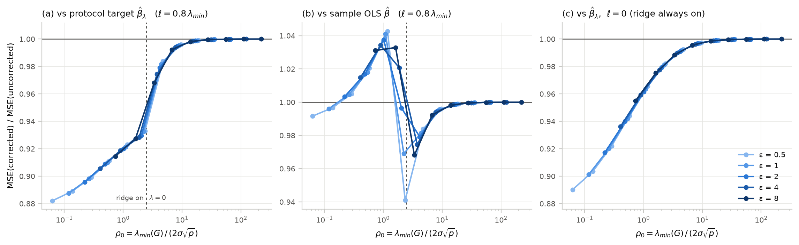
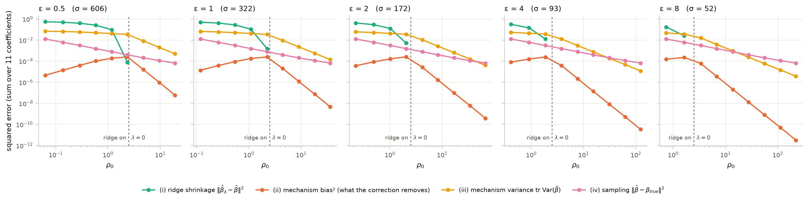
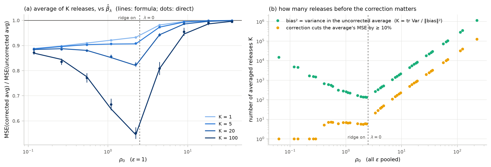
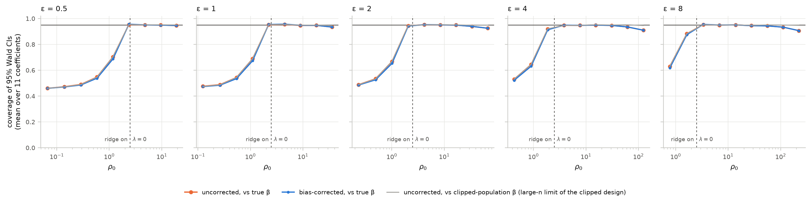
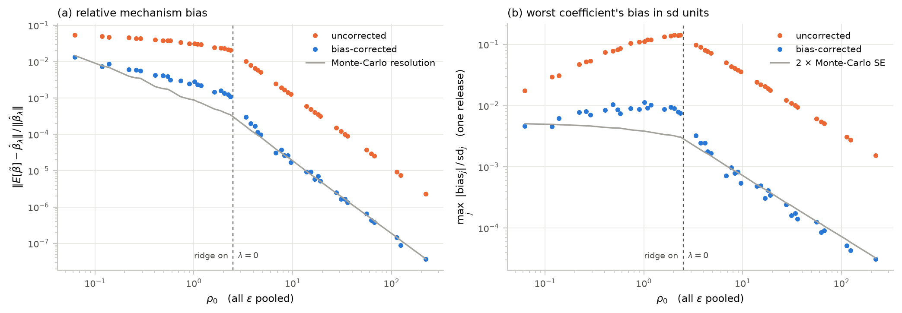
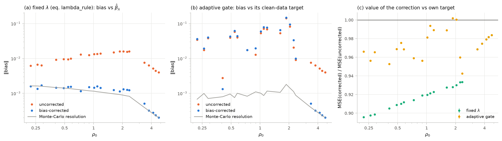
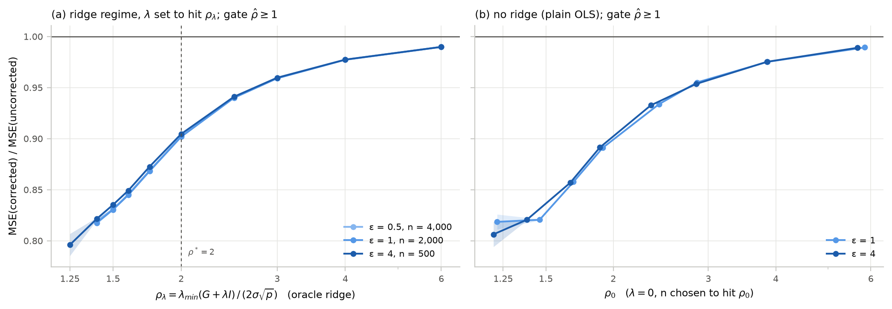
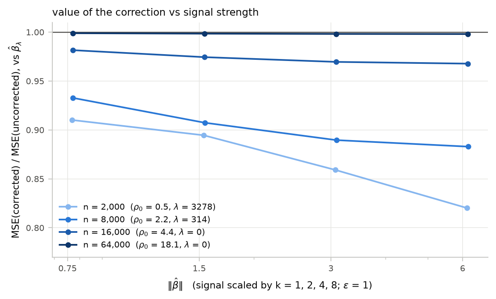

# Does the zero-budget bias correction matter when σ is large?

## Answer

**Not as a bias correction.** In a single release, the bias it removes is at most 0.75% of the
MSE, and the worst coefficient's bias is at most 0.14 of its standard deviation. When σ is large,
the fixed ridge is on and 72–90% of the error against the true β is ridge shrinkage, which the
correction does not touch.

**It is still worth applying, for a different reason.** The correction term is computed from the
noisy Gram matrix, so it also shrinks the noise. That cuts the MSE around the protocol's target
β̂_λ by:
- 7–12% when the ridge is on;
- 2–3% just past the point where the ridge switches off;
- under 0.5% once ρ₀ > 10.

It never increased that MSE in any cell, seed or stress setting.

**When the bias itself matters.** Only when many releases of the same data are averaged: at least
about 130 releases, rising as roughly 23·ρ₀².

**When the correction costs something.** Against the sample OLS β̂ or the true β, with a moderate
ridge on, the correction costs 0.3–4.3% MSE. It removes a noise-driven inflation that happened to
offset part of the ridge shrinkage.

## Setup

- **Population.** `sim_core.Population(d_R=4, d_O=6, r2=0.5, seed=0)` gives p = 11 with the
  intercept and ‖β_true‖ = 0.78. Features have mixed scales and are standardized with public
  constants, then clipped to committed bounds (B_R = 5.59, B_O = 6.24, B_y = 2.89).
- **Privacy calibration.** Replace-one Δ = 86.2, δ = 1e-5, analytic-Gaussian σ = 606, 322, 172, 93,
  52 for ε = 0.5, 1, 2, 4, 8.
- **Estimator.** Fixed ridge `λ = max{0, 2ρ*σ√p − nℓ}` with ρ* = 2 and
  ℓ = 0.8·λ_min(pop) = 0.494. A sensitivity run uses ℓ = 0. Ψ = I. The correction is
  `β_bc = β̃ − σ²M(P̃)β̃`, and the release gate is ρ̂ ≥ 1.
- **Regimes.** The ridge is on for ρ₀ ≲ 2.5 (= ρ*/0.8). ρ₀ = λ_min(G)/(2σ√p) spans 0.06–222 on the
  n × ε grid.
- **Two targets.** "vs β̂_λ" is the protocol's stated estimand (the ridge target at the fixed λ,
  paper eq. (bc)). "vs OLS β̂" and "vs true β" are the estimands a researcher usually has in mind.
- **Monte Carlo sizes:**
  - **E1:** 5 data seeds × 10,000 antithetic pairs (100,000 releases per cell).
  - **Full mode:** 1,000 fresh datasets plus noise per cell.
  - **E4:** 5 seeds × 1,000 pairs.
  - **Stress test:** 5 seeds × 10,000 pairs.
  - **Signal-strength check:** 5 seeds × 5,000 pairs.
- **Confidence intervals.** MSE-ratio CIs are paired delta-method intervals over antithetic pairs,
  combined across seeds. Bias norms are debiased for Monte-Carlo noise; 0 means "below Monte-Carlo
  resolution".

## Key numbers

**Table 1 — ε = 1 across n (ℓ = 0.8 λ_min).** "Gain from bias / variance" splits 1 − ratio into the
part from the removed bias² and the part from lower variance.

| n | ρ₀ | λ | bias² share of MSE (uncorr.) | max_j \|bias_j\|/sd_j, uncorr. → corr. | MSE ratio corr./uncorr. vs β̂_λ (95% CI) | gain from bias / variance | MSE ratio vs OLS β̂ | MSE ratio vs true β (full mode) | Wald coverage vs true β, uncorr. / corr. |
|---|---|---|---|---|---|---|---|---|---|
| 500 | 0.12 | 4018 | 0.02% | 0.029 → 0.005 | 0.8875 ± 0.0002 | 0.02% / 11.2% | 0.996 | 0.997 ± 0.001 | 0.476 / 0.473 |
| 1,000 | 0.26 | 3771 | 0.07% | 0.052 → 0.008 | 0.8982 ± 0.0002 | 0.06% / 10.1% | 1.005 | 1.004 ± 0.001 | 0.489 / 0.484 |
| 2,000 | 0.54 | 3278 | 0.18% | 0.082 → 0.009 | 0.9099 ± 0.0002 | 0.18% / 8.8% | 1.018 | 1.019 ± 0.001 | 0.544 / 0.535 |
| 4,000 | 1.09 | 2290 | 0.43% | 0.119 → 0.009 | 0.9213 ± 0.0002 | 0.43% / 7.4% | 1.041 | 1.040 ± 0.001 | 0.689 / 0.673 |
| 8,000 | 2.23 | 314 | 0.72% | 0.141 → 0.008 | 0.9327 ± 0.0002 | 0.72% / 6.0% | 0.969 | 0.967 ± 0.006 | 0.952 / 0.954 |
| 16,000 | 4.43 | 0 | 0.22% | 0.077 → 0.002 | 0.98160 ± 0.00005 | 0.22% / 1.6% | 0.982 | 0.983 ± 0.003 | 0.954 / 0.957 |
| 32,000 | 8.97 | 0 | 0.05% | 0.038 → 0.001 | 0.99552 ± 0.00001 | 0.05% / 0.40% | 0.996 | 0.997 ± 0.001 | 0.947 / 0.948 |
| 64,000 | 18.1 | 0 | 0.01% | 0.019 → 0.000 | 0.99890 | 0.01% / 0.10% | 0.999 | 0.9993 ± 0.0005 | 0.947 / 0.947 |
| 128,000 | 35.8 | 0 | 0.003% | 0.010 → 0.000 | 0.99972 | 0.003% / 0.025% | 1.000 | 1.0002 ± 0.0002 | 0.934 / 0.934 * |

\* 0.945 against the clipped-population β. At n ≥ 64k, clipping bias (not DP) pulls coverage below
0.95 against the unclipped β_true.

**Table 2 — all 45 grid cells (ℓ = 0.8 λ_min), binned by ρ₀.**

| ρ₀ | cells | MSE ratio vs β̂_λ | bias² share (uncorr.), max | max_j \|bias_j\|/sd_j (uncorr.), max | mean gain: bias / variance | MSE ratio vs OLS β̂ |
|---|---|---|---|---|---|---|
| < 1 (heavy ridge) | 12 | 0.882 – 0.919 | 0.35% | 0.11 | 0.13% / 9.7% | 0.992 – 1.034 |
| 1 – 2.5 (ridge) | 8 | 0.920 – 0.933 | 0.75% | 0.14 | 0.59% / 6.7% | 0.941 – 1.043 |
| 2.5 – 5 (λ = 0) | 5 | 0.968 – 0.984 | 0.37% | 0.10 | 0.27% / 2.0% | same (λ = 0) |
| 5 – 10 | 5 | 0.992 – 0.996 | 0.09% | 0.05 | 0.07% / 0.48% | same |
| 10 – 30 | 6 | 0.998 – 0.9995 | 0.02% | 0.024 | 0.01% / 0.11% | same |
| ≥ 30 | 9 | 0.9996 – 1.0000 | 0.005% | 0.011 | < 0.01% | same |

- **Largest MSE ratio vs β̂_λ, over all 90 cells (both ℓ) and all 450 seed-level values:** 0.999993.
  The correction was never harmful against the protocol target.
- **A simple law fits the gain:** 1 − ratio ≈ 0.36/ρ_λ², where ρ_λ = λ_min(G + λI)/(2σ√p). The
  constant is 0.35–0.47 over all 45 cells (median 0.363).
- **Most of the gain is variance, not bias.** About 75% of the variance drop is the linear
  contraction (I − σ²M(P_λ)) applied to the noise; the rest is the fluctuation of M(P̃) itself. The
  paper's O(σ³) fluctuation term therefore changes the MSE at O(σ⁴), the same order as bias², and
  with a favourable sign.
- **The residual bias after correction is small:**
  - About 5–13% of the original bias in the ridge regime, where ρ_λ ≈ 2 (the O(σ⁴) remainder,
    resolved by Monte Carlo).
  - Below Monte-Carlo resolution once λ = 0 (fig. 5).
- **ℓ = 0 sensitivity.** The ridge is always on, so ρ_λ = 2 + ρ₀.
  - MSE ratio vs β̂_λ is 0.890–1.000, never above 1.
  - MSE ratio vs OLS β̂ is 0.993–1.018.
  - Coverage vs the true β is 42–81% everywhere, from permanent shrinkage (not from the
    correction).

### E2 — what the error is made of when σ is large (fig. 2)

Error against the true β, as a share of the full-mode MSE:

| Regime | Ridge shrinkage | Mechanism variance | Mechanism bias² (what the correction removes) | Sampling |
|---|---|---|---|---|
| Heavy ridge (ρ₀ < 1) | 72–90% | 11–31% | ≤ 0.14% | ≤ 6% |
| At the switch (ρ₀ ≈ 2.3) | — | ≈ 100% | peaks at 0.75% | — |
| Beyond (λ = 0) | 0 | shrinks as 1/n² | < 0.4% | grows as a share, 5% → 95% |

(Cross terms are −4% to −11% of the total in the ridge regime; the shares above can therefore sum
to slightly over 100%.) Mechanism bias² is 2–4 orders of magnitude below mechanism variance at
every ρ₀.

### E3 — averaging K releases of the same data (fig. 3)

The analytic line uses MSE_K = ‖bias‖² + tr Var/K. It is confirmed by direct averaging of
independent releases at K = 1, 5, 20 and 100. For example, at ρ₀ = 2.23 and K = 100, direct gives
0.552 ± 0.023 against 0.545 from the formula.

| ρ₀ | 0.06 | 0.26 | 0.54 | 1.09 | 2.23 | 3.37 | 4.43 | 8.97 | 18.1 | 35.8 | 113 |
|---|---|---|---|---|---|---|---|---|---|---|---|
| K for a ≥ 10% MSE cut | 1 | 1 | 7 | 7 | 6 | 22 | 43 | 201 | 831 | 3,283 | 32,100 |
| K at which bias² = variance (uncorrected average) | 15,100 | 1,540 | 565 | 232 | 138 | 270 | 460 | 1,880 | 7,550 | 29,600 | 289,000 |

- **Fits for λ = 0:** K₁₀% ≈ 2.1·ρ₀^2.05 and K_bias²=var ≈ 23.5·ρ₀^2.00.
- **The bias matters soonest at the ridge switch (ρ₀ ≈ 2.3), and even there only after about 130
  averaged releases.** In the heavy-ridge regime, a single release already gets a 10% cut, but from
  the variance effect.
- **Averaging K releases is itself a poor design.** K releases at σ cost the same zCDP as one
  release at σ/√K. That single release has the same variance and K× less bias.

### E4 — fixed λ vs the original adaptive gate (fig. 6; 22 cells with 0.25 ≤ ρ₀ ≤ 5, 17 of them in the ridge regime)

| ε | n | ρ₀ | adaptive Ψ | λ fixed | λ adaptive, mean (clean-data λ*) | residual/bias, fixed \| adaptive | MSE ratio corr./uncorr., fixed \| adaptive | adaptive-corr. MSE ÷ fixed-corr. MSE, vs OLS β̂ |
|---|---|---|---|---|---|---|---|---|
| 0.5 | 2,000 | 0.29 | I | 7052 | 11058 (7372) | 0.13 \| 1.05 | 0.899 \| 0.966 | 1.06 |
| 1 | 2,000 | 0.54 | I | 3278 | 4933 (3276) | 0.08 \| 1.07 | 0.910 \| 0.975 | 1.14 |
| 1 | 4,000 | 1.09 | I | 2290 | 3331 (2184) | 0.09 \| 1.11 | 0.921 \| 0.994 | 1.26 |
| 4 | 1,000 | 0.90 | I | 742 | 1095 (971) | 0.08 \| 1.53 | 0.919 \| 0.956 | 1.23 |
| 8 | 1,000 | 1.62 | I | 192 | 275 (166) | 0.06 \| 1.22 | 0.928 \| 0.989 | 1.18 |
| 4 | 2,000 | 1.87 | Π_O | 248 | 1421 (305) | 0.05 \| 1.05 | 0.928 \| **1.0019 ± 0.0006** | 1.89 |
| 2 | 4,000 | 2.04 | Π_O | 304 | 611 (0) | 0.06 \| 1.15 | 0.930 \| 1.0004 ± 0.0009 | 1.11 |
| 1 | 8,000 | 2.23 | Π_O | 314 | 370 (0) | 0.06 \| 1.63 | 0.933 \| 0.960 | 1.03 |
| 0.5 | 16,000 | 2.35 | Π_O | 137 | 184 (0) | 0.06 \| 1.11 | 0.933 \| 0.943 | 0.99 |

**Fixed λ.** Across all 17 ridge cells, the correction removes 87–98% of the bias: residual/bias is
0.02–0.13. The corrected estimate's bias is at Monte-Carlo resolution in E4 (max |z| ≤ 2.9).

**Adaptive gate (ridge cells):**
- **The correction removes nothing.** Residual/bias is 1.00–1.63 in 16 of 17 cells (median 1.10;
  one exception at 0.40), with the residual highly significant (max |z| 18–199).
- **Why.** The gate picks λ from the noisy G̃. That λ̃ is systematically larger than the clean-data
  λ* (×1.1–4.7, from the lower λ_min of G̃ and the ×1.5 search grid). No σ²M(P) term can account
  for this; it is the mechanism described in Section 7.4 of the paper.
- **The MSE gain from correcting is smaller:** 0.943–1.002 (fixed λ: 0.896–0.933).
- **Near its onset the correction is mildly harmful:** 1.0019 ± 0.0006 at ε = 4, n = 2,000, with
  single datasets up to +1.6%.
- **Against OLS β̂, adaptive + correction is 3–89% worse than fixed λ + correction.** The one
  exception is right at the switch (ε = 0.5, n = 16k), where it is 0.6% better.

The paper's Section 7.4 has been updated to report this 1.0–1.6× figure for the original gate. The
3–5× it previously quoted came from a stylized adaptive rule.

### Stress test for a threshold (fig. 7)

These runs push ρ_λ below what the fixed rule ever produces. Every value below passed the release
gate ρ̂ ≥ 1.

| ρ_λ (oracle ridge) | 1.25 | 1.4 | 1.5 | 1.6 | 1.75 | 2.0 | 2.5 | 3 | 4 | 6 |
|---|---|---|---|---|---|---|---|---|---|---|
| gate pass rate | 0.02% | 4–6% | 26–31% | 61–66% | 93–95% | 99.95% | 100% | 100% | 100% | 100% |
| MSE ratio vs β̂_λ | 0.80 | 0.82 | 0.83 | 0.85 | 0.87 | 0.90 | 0.94 | 0.96 | 0.977 | 0.990 |

- **Plain OLS (λ = 0) at ρ₀ = 1.2–5.9 behaves the same way:** 0.81, 0.82, 0.86, 0.89, 0.93, 0.95,
  0.975 and 0.989.
- **There is no ρ below which the correction starts to hurt.** Its benefit grows monotonically down
  to the point where the gate refuses almost every release.

### Signal strength (fig. 8)

Scaling c → k·c multiplies β̂ by k, with the same design, σ and noise draws. The gain grows with
‖β̂‖, from ‖β̂‖ = 0.77 to 6.2:

| n | ρ₀ | λ | MSE ratio at ‖β̂‖ = 0.77 → 6.2 |
|---|---|---|---|
| 2,000 | 0.54 | 3278 | 0.910 → 0.820 |
| 8,000 | 2.2 | 314 | 0.933 → 0.883 |
| 16,000 | 4.4 | 0 | 0.982 → 0.968 |
| 64,000 | 18 | 0 | 0.9989 → 0.9980 |

The numbers above are therefore conservative for populations with larger standardized
coefficients.

## Proposed rule

**Apply the correction to every release that passes the release gate ρ̂ ≥ 1, whatever ρ̂ is.** In
other words, ρ_bc is the gate itself; there is no extra threshold.

**Why:**
- **E1: it never hurts against the protocol target.** Against β̂_λ, the MSE ratio is below 1 in all
  90 cells and 450 seed-level estimates (max 0.999993).
- **Stress test: no threshold exists.** The ratio falls monotonically to 0.80 as ρ_λ drops to 1.25,
  where the gate passes only 0.02% of releases.
- **The size of the benefit is predictable.** It is about 0.36/ρ_λ²: at least 1% for ρ_λ ≲ 6, and
  below 0.1% beyond ρ_λ ≈ 19.
  - Above that point, skipping the correction would be harmless.
  - Applying it is still free (post-processing), so "always" is simpler and never worse.

**One qualification, about the estimand rather than ρ̂:**
- **When the ridge is moderately active and the target is OLS or the true β, the correction costs
  0.3–4.3% MSE.** This applies when λ is between 0.2 and 8 times λ_min(G): 14 of the 20 grid cells
  with λ > 0.
- **Why it costs.** The noise inflates β̃ away from zero and so partly cancels the ridge shrinkage.
  The correction removes that inflation and restores the full shrinkage.
- **The same shift slightly lowers Wald coverage.** Coverage vs the true β drops by at most 1.6
  points in that window. Where λ = 0 it changes by −0.04 to +0.26 points.
- **Dropping the correction is not the right response.** In that window shrinkage is 40–90% of the
  error, and coverage vs the true β is 46–92% with or without the correction.
- **The right lever is the ridge itself:** a sharper committed ℓ, larger n, or larger ε.
- **What to report.** Keep reporting β̂_bc as the estimate of β̂_λ, with the shrinkage −λP̃β̃ stated
  separately (paper, Section 7.5).

## Figures


**Fig. 1 — MSE(corrected)/MSE(uncorrected) vs ρ₀.** Lines are ε (light → dark) with 95%
Monte-Carlo bands; the bands are thinner than the lines.
- **(a) vs the protocol target β̂_λ.**
- **(b) vs sample OLS β̂.** It shows the 0.3–4.3% cost with a moderate ridge.
- **(c) ℓ = 0.**
- The dashed line marks where the fixed ridge switches off (ρ₀ = ρ*/0.8 = 2.5).


**Fig. 2 — Error against the true β split into ridge shrinkage, mechanism bias², mechanism variance
and sampling, by ε.** Mechanism bias² is 100–10,000× below the mechanism variance at every ρ₀. When
σ is large (left of the dashed line), shrinkage dominates.


**Fig. 3 — Averaging K releases of the same data.**
- **(a) ε = 1:** MSE ratio of the averaged estimates. Lines are the bias/variance formula; dots with
  95% CIs are direct averages of independent releases.
- **(b) all ε:** the K at which bias² equals the variance of the uncorrected average, and the K
  needed for a ≥ 10% MSE cut.


**Fig. 4 — Coverage of 95% Wald intervals (first-order variance), mean over 11 coefficients, 1,000
fresh datasets per point.**
- **Where the ridge is on:** coverage collapses (46–92%), and the correction cannot help.
- **Where λ = 0:** coverage is 0.943–0.957 up to n = 32k.
- **At the largest n:** the dip is clipping bias. The grey line is coverage against the
  clipped-population β.
- **Calibration:** plug-in SEs are within 0.99–1.03 of the empirical SDs.


**Fig. 5 — Mechanism bias before and after correction.**
- **(a)** Relative to ‖β̂_λ‖.
- **(b)** Worst coefficient, in sd units.
- The grey line is Monte-Carlo resolution. After correction the bias sits at that floor for λ = 0;
  in the ridge regime a small O(σ⁴) residual (5–13% of the original) remains.


**Fig. 6 — Fixed λ vs the adaptive gate.** With the adaptive gate, the corrected bias is no smaller
than the uncorrected bias.


**Fig. 7 — Stress test.** MSE ratio when ρ_λ is pushed to the gate's limit, with an oracle ridge (a)
and with plain OLS (b).


**Fig. 8 — Value of the correction as the regression signal ‖β̂‖ grows.** Design, σ and noise draws
are unchanged.

## Comparison with the earlier evidence

The earlier study used the user's adaptive modules. Its own output,
`reports/accuracy/results_summary.csv`, gives MSE(bc)/MSE(ridge) against β_GT (sample OLS on the
true matches):
- **Forced full ridge:** 1.000–1.066. The correction *raised* MSE by up to 6.6% (at ρ₀ = 1.79).
- **ρ₀ ≈ 2.7–3.9 (λ at its 1e-3 floor):** 0.89–0.95. It *lowered* MSE by 5–11%.
- **ρ₀ ≈ 6–7:** 0.98–0.99.

(The first version of the brief for this study stated these with the signs reversed; the plan file
has since been corrected.)

| Regime | Earlier (vs β_GT, adaptive gate) | This study vs OLS β̂ (fixed λ) | This study vs β̂_λ |
|---|---|---|---|
| Forced full ridge (ρ₀ < 2) | +0.0 to +6.6% | −0.8 to +4.3% (vs true β: −0.3 to +4.1%) | −7 to −12% |
| ρ₀ ≈ 2.7–4, λ ≈ 0 | −5 to −11% | −1.6 to −3.2% (grid, ρ₀ 3.4–4.8); −4.5 to −6.7% at ρ₀ 2.4–2.9 (stress test) | same (λ = 0) |
| ρ₀ ≈ 6–7 | −1 to −2% | −0.8% | same |
| ρ₀ > 10 | < 1% | < 0.2% | same |

- **Confirmed: the shape.** The correction helps where the ridge is off, costs a few percent
  against OLS under a forced moderate-to-heavy ridge, and fades beyond ρ₀ ≈ 10.
- **Refuted: reading the full-ridge result as "the correction doesn't help when σ is large".**
  Against the protocol's own target, the correction helps *most* when σ is large (−7 to −12%). The
  earlier "harm" was a change of target, not a failure of the correction.
- **Why the earlier gains were bigger at λ ≈ 0.** The earlier population had ‖β‖ = 2.5–4.3 on raw
  U[0,1] features with R² ≈ 0.98, against 0.78 here, and fig. 8 shows the gain grows with ‖β̂‖.

## Other findings

- **The release gate refuses some releases at ρ* = 2.** The gate is ρ̂ ≥ 1. When the ridge
  dominates, ρ̂ sits about 0.5–0.9 below ρ_λ (λ_min(G_λ + E) loses almost the whole noise edge).
  - With ℓ = 0.8 λ_min(pop), up to 1.6% of releases are refused (n = 500, ε = 0.5; realized
    λ_min(G)/n there is slightly below ℓ).
  - At ρ_λ = 1.75, 5–7% would be refused; at ρ_λ = 1.5, about 70%.
  - A refused release still spends the budget, so ρ* ≈ 2.5 would make refusals negligible.
- **ℓ = 0 is harmful for inference.** The paper describes ℓ = 0 as a "certificate". With ℓ = 0 the
  ridge never switches off: λ = 2ρ*σ√p is still 10% of λ_min(G) at n = 128k, ε = 0.5. Wald coverage
  vs the true β is then 42–81% even at n = 128k.
- **The first-order variance is accurate.** Plug-in SEs match the empirical SD within 0.99–1.03 in
  every cell. The correction shrinks interval width by at most 0.7%.

## Notes on sim_core

- **No bugs found.** `tests/test_sim_core.py` passes (14 tests). sim_core was used unmodified.
- **`Population.beta_true` is the unclipped truth.** The large-n limit of OLS on the clipped design
  differs by up to 0.0023 per coefficient (‖Δ‖ = 0.004). At n ≥ 64k that is about one standard
  error, so Wald coverage against `beta_true` drops to 0.91–0.94 while coverage against the clipped
  limit stays at 0.945–0.952. Coverage studies at large n should report both. This study stores the
  clipped limit in `experiments/_work/bias_correction/beta_clip_pop.json`, computed from 4M rows.
- **`adaptive_gate` returns (β, β_bc, λ) but not the Ψ it chose.** The mode here is inferred from
  λ_min(A)/(2σ√p) ≥ 2. That is exact, because A is noiseless, so the mode is the same for every
  draw.

## Reproduce

```bash
python experiments/bias_correction_study.py --stage e1       # ~4 min (1 core)
python experiments/bias_correction_study.py --stage full     # ~3.5 min
python experiments/bias_correction_study.py --stage stress   # ~2 min
python experiments/bias_correction_study.py --stage signal   # ~20 s
python experiments/bias_correction_study.py --stage e4       # ~4 min (adaptive gate is per-draw)
python experiments/bias_correction_study.py --stage report   # merge -> results.json, CSV, figures
python experiments/bias_correction_study.py --quick          # smoke test of everything (~40 s)
```

- **`results.json`** holds every per-cell number, per-seed ratios, bias vectors (seed 0), the E2
  table and a `summary` block with the headline numbers and the rule.
- **`e1_value_map.csv`** is the flat per-cell table for both values of ℓ.
