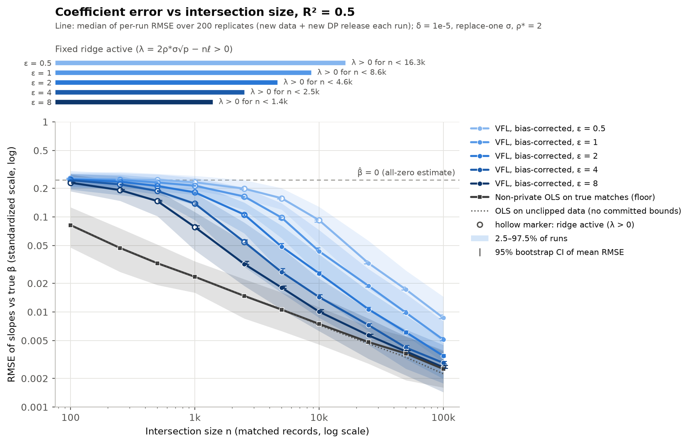
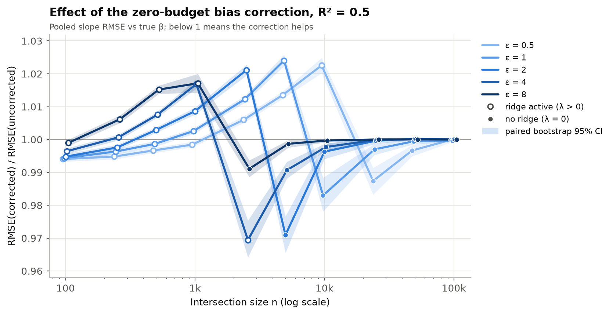
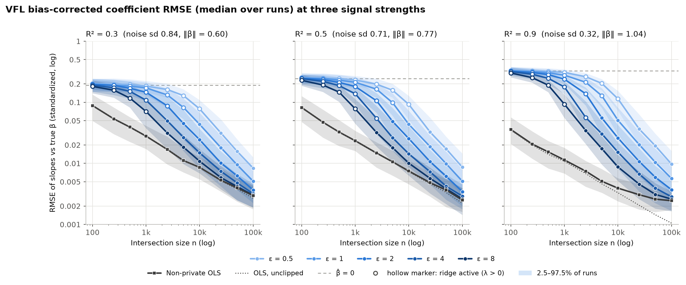
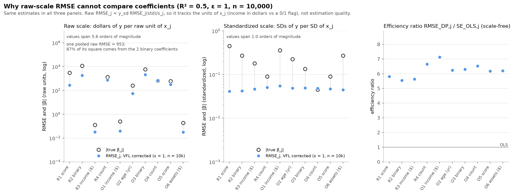
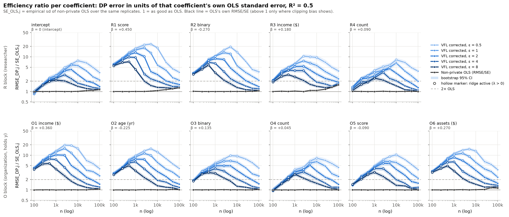
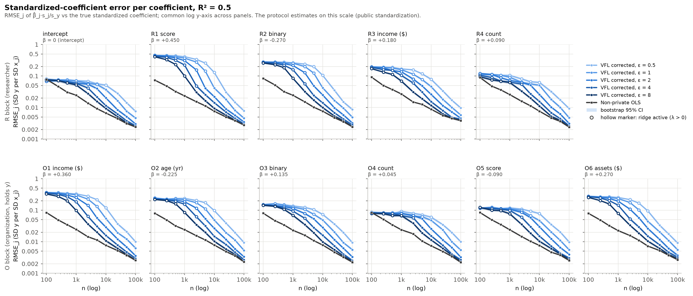
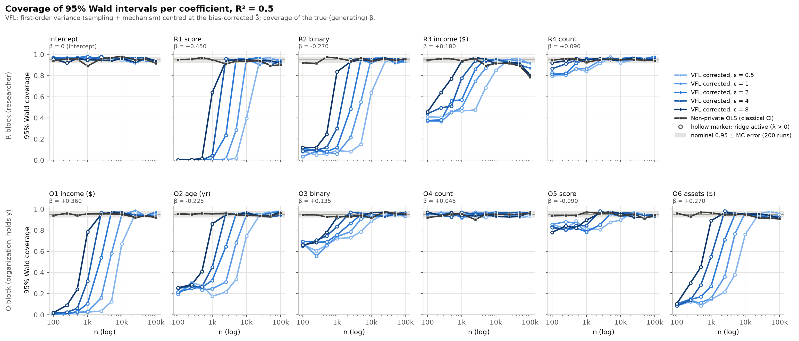
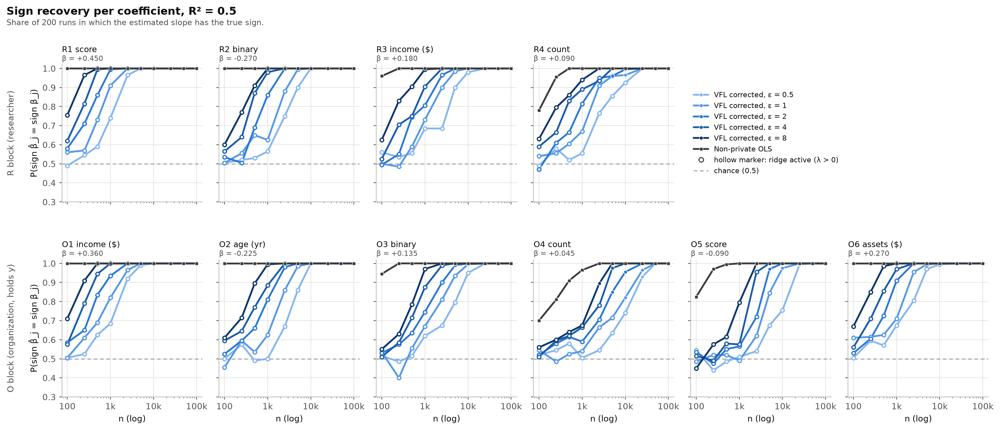

# Coefficient accuracy of the VFL estimator vs intersection size

This report answers the reviewer's request:

> "a graphic which compares our VFL β (with bias correction) with true β (like RMSE) against the
> intersection size (log scale), for different ε values, with confidence intervals showing the
> variation across runs. In real implementations the β coefficients would have different scales,
> so is there a way to compare them separately?"

Everything here is produced by `experiments/coef_accuracy_figures.py`, which builds on the shared
core `experiments/sim_core.py` (used read-only). The run takes about 3 minutes; `--plots-only`
re-plots from the saved per-replicate estimates. Those `.npz` files are regenerated by the script
and are not committed.

## Short answer

- **Figure A** plots the RMSE of the bias-corrected VFL slopes against the true β on the
  standardized scale. The x-axis is n on a log scale, with one line per ε.
  - The line is the median over 200 runs, and each run draws a new dataset and a new DP release.
  - The band shows the 2.5–97.5% spread across runs, and the error bars give a bootstrap CI for the
    mean.
  - Every panel includes the non-private OLS floor.
  - The VFL error reaches **2× the OLS floor at n ≈ 3.2k (ε = 8), 9.4k (ε = 4) and 34k (ε = 2).** At
    ε = 1 the ratio is 2.04 at n = 100k, so the crossing is at about 105k (extrapolated). At ε = 0.5
    it is about 380k (extrapolated).
- **Coefficients on different scales**: compare them one at a time with the **efficiency ratio**
  RMSE_DP,j / SE_OLS,j (Figure B1). This is the extra error in units of that coefficient's own OLS
  standard error.
  - It does not change when x_j or y is rescaled.
  - It has a direct reading: DP at ratio r is about as accurate as OLS on n/r² records.
  - Two complements are the standardized-coefficient error (B2) and the relative error for
    coefficients well away from zero (B3).
  - Raw-scale RMSE cannot be compared across coefficients (B4). Its values span 5.6 orders of
    magnitude purely because of units, and 87% of a pooled raw MSE comes from the two binary
    coefficients.
- Once the fixed ridge switches off (λ = 0), the DP cost is **nearly uniform across coefficients**.
  The efficiency ratios agree to within about ±15%, and O-block coefficients sit about 10% higher
  than R-block ones. While the ridge is on, the coefficients with the largest |β_j| suffer most,
  because the ridge shrinks them towards 0.

## Setup

| Item | Value |
|---|---|
| Population | `Population(d_R=4, d_O=6, r2, seed=0)`. Features have realistic raw scales: score (gaussian), binary (31%), income and assets (lognormal, $), count, and age. They are Toeplitz-correlated (0.3), standardized with public population constants, and clipped to committed 99.5% bounds. |
| True β | The generating standardized slopes. For R² = 0.5: R1 score +0.450, R2 binary −0.270, R3 income +0.180, R4 count +0.090, O1 income +0.360, O2 age −0.225, O3 binary +0.135, O4 count +0.045, O5 score −0.090, O6 assets +0.270. The intercept is 0. |
| Privacy | ε ∈ {0.5, 1, 2, 4, 8}, δ = 1e-5, replace-one Δ = 86.2, analytic Gaussian. This gives σ = 606, 322, 172, 93, 52. |
| Ridge | λ = max{0, 2ρ*σ√p − nℓ}, with ρ* = 2, p = 11 and ℓ = 0.8·λ_min,pop = 0.494. The ridge is active for n < 16.3k, 8.6k, 4.6k, 2.5k, 1.4k (ε = 0.5 … 8). |
| Monte Carlo | n ∈ {100, 250, 500, 1k, 2.5k, 5k, 10k, 25k, 50k, 100k}, with R = 200 replicates per n and per R² ∈ {0.3, 0.5, 0.9}. Each replicate draws a new cohort, which is shared across ε. Each ε then gets its own independent release. |
| Estimators | **VFL bias-corrected** (the main estimator), VFL uncorrected, **non-private OLS on the true matches** (the floor; plaintext linkage plus OLS gives exactly this), and OLS on the unclipped data (no committed bounds; a reference only). |
| Intervals | Wald intervals from `first_order_cov` (sampling plus mechanism), centred at the bias-corrected β̂. OLS uses the classical s²(ZᵀZ)⁻¹. |
| Metrics | Slopes only unless stated; the intercept is reported separately. Bootstraps use 2,000 resamples of the runs, and paired metrics share the resamples. |

## Figure A: RMSE against intersection size (main figure)

How to read it:
- **y-axis:** the per-run RMSE of the 10 slopes against the true β, on the standardized scale (SDs
  of y per SD of x_j).
- **Lines:** the median across runs.
- **Band:** the 2.5–97.5% range of the per-run RMSE, i.e. the run-to-run variation from sampling
  and noise together.
- **Error bars:** a 95% bootstrap CI for the mean RMSE. These are tiny, so Monte Carlo error does
  not matter here.
- **Hollow markers and top strip:** where the fixed ridge is active.
- **Dashed line:** the error of reporting β̂ = 0.
- **Dotted line:** OLS without committed bounds.

**Key numbers (R² = 0.5).** Cells show the median per-run RMSE, then the [2.5–97.5%] range across
runs, then (the ratio to the median OLS floor).

| n | ε = 0.5 | ε = 1 | ε = 2 | ε = 4 | ε = 8 | OLS floor |
|---|---|---|---|---|---|---|
| 1,000 | 0.231 [0.190–0.271] (9.9×) | 0.213 [0.171–0.258] (9.1×) | 0.181 [0.133–0.228] (7.7×) | 0.138 [0.093–0.178] (5.9×) | 0.078 [0.045–0.113] (3.3×) | 0.0234 [0.0159–0.0341] |
| 10,000 | 0.092 [0.052–0.128] (12.3×) | 0.044 [0.025–0.073] (5.8×) | 0.025 [0.015–0.040] (3.4×) | 0.014 [0.009–0.023] (1.9×) | 0.010 [0.006–0.015] (1.3×) | 0.0075 [0.0045–0.0112] |
| 100,000 | 0.0087 [0.0048–0.0145] (3.4×) | 0.0051 [0.0029–0.0080] (2.0×) | 0.0034 [0.0020–0.0050] (1.4×) | 0.0029 [0.0018–0.0045] (1.2×) | 0.0026 [0.0014–0.0040] (1.0×) | 0.0025 [0.0016–0.0038] |

**n at which the VFL error comes within 2× of the OLS floor.** These use the pooled RMSE,
interpolated in log-log coordinates. The median line gives values within 5% of these.

| R² | ε = 0.5 | ε = 1 | ε = 2 | ε = 4 | ε = 8 |
|---|---|---|---|---|---|
| 0.3 | > 100k (≈ 240k extrap.) | 75k | 21k | 7.1k | 1.9k |
| **0.5** | > 100k (≈ 380k extrap.) | > 100k (ratio 2.04 at 100k; ≈ 105k) | **34k** | **9.4k** | **3.2k** |
| 0.9 | > 100k | > 100k (ratio 2.45) | 66k | 30k | 13k |

The extrapolation assumes that the DP excess MSE falls like 1/n² against the sampling MSE's 1/n. It
is approximate, and at R² = 0.9 it does not apply because clipping bias holds the floor up.

What the figure shows:
1. **Three regimes.**
   - While λ > 0 (hollow markers), the estimator is shrunk towards 0. Its RMSE sits close to the
     "β̂ = 0" line (0.244), about 3 to 15 times the floor.
   - For n below roughly n*(ε)/3, the release says little about the slopes. At R² = 0.3 it is even
     marginally worse than reporting zeros (0.20 against 0.19 at n = 100), because the shrunk
     estimate is mostly mechanism noise f/λ.
   - Once λ = 0, the DP excess error falls like 1/n, twice as fast in log-log as the floor's 1/√n.
     The curves then merge into the floor.
2. **The variation across runs is large.** The 95% run range spans about a factor of 2.5 to 3 at
   every n (for example 0.025–0.073 at ε = 1, n = 10k). A single release can be much better or much
   worse than the median.
3. **Unclipped OLS (dotted)** coincides with the floor up to n ≈ 25k at R² = 0.5. It separates only
   at n ≥ 50k, where clipping bias starts to show.

### Figure A2: does the bias correction matter?

The pooled slope RMSE of the corrected estimator divided by that of the uncorrected one, with a
paired-bootstrap CI.
- **The effect is small everywhere: within ±3.5%.**
- **Where it helps:** the correction lowers the RMSE by 2–4% in the first cell after the ridge
  switches off. There the clean ρ is about 2.3–2.8:
  - n = 2.5k at ε = 4: −3.1%;
  - n = 5k at ε = 2: −2.9%;
  - n = 10k at ε = 1: −1.7%.
  In those cells it wins in 60–76% of individual runs. At ρ ≈ 3.7 the gain is about −1%.
- **Where it hurts:** it raises the RMSE by 1–3.4% when a moderate ridge is active (clean
  ρ_λ ≈ 2.2). With P̃ ≈ (G + λI)⁻¹ the operator M(P̃) is positive, so the correction shrinks β̂
  further. Against the true β, shrinkage is the dominant error.
- **When the ridge dominates completely** (n = 100): about −0.5%. The estimate there is mostly
  noise, and shrinking noise reduces variance.
- **Beyond ρ ≈ 5** the effect is < 0.2%.

This matches bias/sd ∝ 1/ρ. The results are the same at R² = 0.3 and 0.9.

### Figure A at other signal strengths

Full versions are in `figA_rmse_vs_n_r2_0.3.png` and `figA_rmse_vs_n_r2_0.9.png`.
- A stronger signal lowers the OLS floor. The noise sd is 0.84, 0.71 and 0.32 for R² = 0.3, 0.5 and
  0.9.
- The DP part barely changes: σ is set by the committed bounds, not by R².
- As a result, **the ratio to the floor is largest at high R²**. At n = 10k and ε = 2 it is 2.8×,
  3.4× and 6.6× for R² = 0.3, 0.5 and 0.9.
- In the ridge regime the error sits at ‖β‖/√10, which grows with R².
- At R² = 0.9 the clipped OLS floor flattens from n ≈ 10k onwards (0.0025 at 100k, against 0.0011
  unclipped). This is clipping bias.

## Figure B: comparing coefficients on different scales

### Why raw-scale RMSE is meaningless across coefficients

The three panels show the same estimates (ε = 1, n = 10k) in three ways.
- **Raw scale.** A raw coefficient is dollars of y per raw unit of x_j, so
  β_raw,j = y_sd·β_std,j/s_j.
  - The income coefficients are about 0.13–0.25 $ per $.
  - The binary coefficients are about 5,800–11,700 $ per unit.
  - Raw RMSEs therefore span **5.6 orders of magnitude**. A single pooled raw RMSE (953 $) is 87%
    driven by the two binary coefficients. It measures which features are binary, not how well
    anything is estimated.
- **Standardized scale.** The same RMSEs all lie within a factor of about 1.3 of each other
  (0.041–0.054).
- **Efficiency ratio.** 5.5–7.1 for every coefficient.

### Recommended scale-free comparisons

1. **Efficiency ratio RMSE_DP,j / SE_OLS,j (Figure B1, the primary metric).**

   

   Why it is the right metric:
   - Rescaling x_j or y multiplies the numerator and the denominator by the same factor y_sd/s_j,
     so the ratio is invariant to units and to the choice of standardization.
   - It answers "how much worse is the private estimate than what the same matched data would give
     without DP?" Since SE ∝ 1/√n, a ratio r means the DP release is about as accurate as OLS on
     n/r² records. For example, ε = 1 at n = 10k gives r ≈ 6, which is equivalent to OLS on about
     280 records; Figure A agrees.
   - It measures each coefficient against its own sampling uncertainty, which differs across
     coefficients because of collinearity.

   SE_OLS,j is the empirical sd of the non-private OLS across the same 200 replicates. Bands are
   paired-bootstrap CIs, and the y-axis is common to all panels.

   What B1 shows:
   - The curves are non-monotone. While the ridge is active the DP error saturates at |β_j| but SE
     keeps falling, so the ratio rises. It peaks at the n where λ reaches 0: up to 23 for R1 at
     ε = 0.5. After that the ratio falls towards 1.
   - With the ridge off, the ratio is nearly equal across coefficients. At n = 25k, ε = 0.5 it runs
     6.6–8.0. At n = 10k, ε = 1 it is 5.5–6.7 for the R block and 6.2–7.1 for the O block. The O
     block is slightly worse, as expected: A is exact, while C and B are noised.
   - The black line is OLS's own RMSE/SE. It rises above 1 only where clipping bias appears (R3
     income at n ≥ 25k).
2. **Standardized-coefficient error (Figure B2).**

   

   This is RMSE_j in units of β_j·s_j/s_y. The protocol already estimates on this scale, because
   both parties standardize with public constants. It is the scale on which pooling coefficients
   into one RMSE (Figure A) makes sense. It still depends on the chosen reference SDs.
3. **Relative error |β̂_j − β_j|/|β_j| (Figure B3), only for |β_std,j| ≥ 0.1.** This covers 7 of the
   10 slopes.
   - It is identical on the raw and standardized scales, because the rescaling cancels, so it is
     unit-free.
   - It blows up as β_j → 0, so it should not be pooled or used for small effects.
   - Rough guide: a median relative error of 10% for the largest coefficients needs n ≈ 2k at
     ε = 8, 3k at ε = 4, 5–6k at ε = 2, 10k at ε = 1 and 25k at ε = 0.5. The smallest included
     coefficient (O3, β = 0.135) needs roughly 2–3 times more.
4. **Inference-level comparisons (Figure C):** coverage and sign recovery, which are scale-free by
   construction.

**Recommendation.** Report Figure A as the headline. Compare coefficients with the efficiency ratio
(B1), with the standardized error (B2) as its absolute counterpart, and with the relative error
only for |β_j| ≥ 0.1. Never pool raw-scale errors.

## Figure C: coverage and sign recovery

**C1 coverage:** the coverage of the true β by the 95% Wald intervals.
- **Ridge off (λ = 0):** the first-order intervals are close to nominal. Mean slope coverage is
  0.935–0.959 across all ridge-off cells with n ≤ 50k (0.940–0.966 at R² = 0.3). No variance
  estimate was ever non-positive.
- **Ridge on:** coverage collapses for the large coefficients: 0.00 for R1 at n ≤ 1k, and a mean of
  0.40–0.60 across slopes. The intervals target the ridge estimand and do not include the
  deterministic shrinkage −λP_λβ̂. Near-zero coefficients still cover. Report intervals only when
  λ = 0, or add the shrinkage explicitly.
- **Large n:** coverage of the generating β declines for OLS as well as VFL. The cause is clipping
  bias:
  - R² = 0.5, n = 100k: R3 income 0.785 (OLS) and 0.805 (VFL, ε = 8).
  - R² = 0.9, n = 100k: mean slope coverage 0.64 (OLS) and 0.70 (VFL, ε = 8). O1 income falls to
    0.02 and 0.095.
  - Against the clipped-population target, the same intervals cover 0.93–0.96.

**C2 sign recovery:** the share of runs in which the estimated slope has the true sign.
- It reaches 1 at about the n where the ridge switches off: n ≈ 1k (ε = 8) up to about 10–25k
  (ε = 0.5). OLS gets there for most coefficients by n ≈ 250–500.
- While the ridge dominates, β̂ ≈ c̃/λ follows the marginal covariances Σβ, not the partial
  effects. The sign is therefore near chance, and it can even be wrong: O5 has β = −0.090 but
  (Σβ)_O5 = +0.004, so it recovers late (n ≥ 5k even at ε = 8).
- Values of 0.40–0.44 in two cells are consistent with chance plus Monte Carlo noise (SE 0.035).

## Release gate and ridge

- **Where λ > 0:**
  - ε = 0.5: n ≤ 10k (λ = 7,990 at n = 100, down to 3,101 at 10k);
  - ε = 1: n ≤ 5k;
  - ε = 2: n ≤ 2.5k;
  - ε = 4: n ≤ 1k, plus a negligible λ = 1 at 2.5k, which is still drawn with the hollow marker;
  - ε = 8: n ≤ 1k.
- **Gate withholding (ρ̂ < 1):** only in ridge-active cells.
  - The rate is 0–2% per cell, with one cell at 5% (R² = 0.3, ε = 1, n = 100).
  - Pooled over ridge-active cells, about 0.45%.
  - The gate never withholds once λ = 0.
- **Why it withholds at all:**
  - With the ridge on, ρ_λ ≈ 2 and ρ̂ ≈ ρ_λ + λ_min(E)/(2σ√p), so the gate fires when
    λ_min(E) < −2σ√p.
  - A 200k-draw check of the masked 11×11 noise gives P = 2.3%. That is the limit as the ridge
    dominates.
  - ρ* ≈ 2.3 would push the rate well below 1%.
- **ℓ is optimistic at small n.**
  - The sample λ_min(G/n) falls below ℓ = 0.8·λ_min,pop in 98% of runs at n = 100, 65% at 250, 20%
    at 500 and 1% at 1k.
  - The clean ρ_λ therefore dips to 1.86–1.99. Harmless here.
  - A finite-sample floor such as (1 − √(p/n))² would make the certificate exact.

## Committed bounds and the meaning of "true β"

- **What clipping does.** Clipping at the committed 99.5% bounds moves the population
  least-squares target away from the generating β:
  - R² = 0.5: largest shift +0.0026 (R3 income), rms 0.0011.
  - R² = 0.9: largest shift −0.0047 (O1 income), rms 0.0021.
- **Why it matters at large n.** At n = 100k the OLS sampling RMSE is 0.0011–0.0023, so the shift is
  comparable or larger. OLS on clipped data and VFL both converge to the clipped target. At
  R² = 0.9, measured against unclipped OLS, no ε reaches 2× by 100k.
- **What it is not.** This is the cost of bounded sensitivity, which any DP pipeline pays; it is not
  a cost of VFL. The ratios in this report use OLS on the same clipped data, so they isolate the DP
  cost.
- **What to do.** Report against the clipped-population target (`beta_clip` in
  `key_numbers_*.json`), or widen the bounds and accept a larger σ.

## Intercept (standardized scale, R² = 0.5)

| n | OLS | ε = 0.5 | ε = 1 | ε = 2 | ε = 4 | ε = 8 |
|---|---|---|---|---|---|---|
| 1k | 0.025 | 0.071 | 0.070 | 0.059 | 0.059 | 0.052 |
| 10k | 0.0067 | 0.051 | 0.037 | 0.020 | 0.012 | 0.009 |
| 100k | 0.0024 | 0.0075 | 0.0046 | 0.0030 | 0.0026 | 0.0024 |

## Files (in `reports/coef_accuracy/`)

| File | Content |
|---|---|
| `figA_rmse_vs_n_r2_{0.5,0.3,0.9}`, `figA_r2_comparison` | Figure A and its R² variants (PNG and PDF) |
| `figA2_correction_ratio_r2_*` | RMSE of corrected vs uncorrected estimates |
| `figB1..B4_*_r2_0.5` | Efficiency ratio, standardized error, relative error, raw vs standardized |
| `figC1_coverage_r2_0.5`, `figC2_sign_recovery_r2_0.5` | Coverage and sign recovery |
| `summary_overall_r2_*.csv` | Per (n, ε, method): RMSE statistics and CIs, λ, ρ̂, gate, coverage, intercept |
| `summary_per_coef_r2_*.csv` | Per coefficient: RMSE, bias, sd, SE_OLS, efficiency ratio with CI, relative error, raw RMSE, coverage (true and clipped target), sign rate |
| `correction_ratio_r2_*.csv` | Corrected/uncorrected ratio with paired CI and the share of runs where the corrected estimate is better |
| `key_numbers_r2_*.json`, `results.json` | Configuration, σ, λ thresholds, β (true, clipped, raw), 2× crossings, gate |
| `run_log.txt` | Console tables from the full run |
